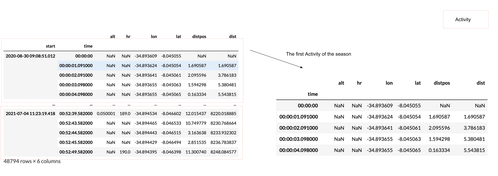
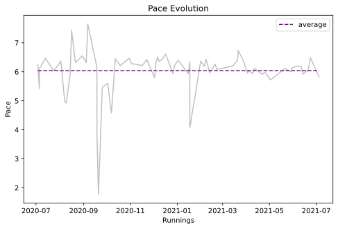
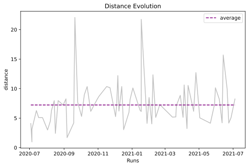
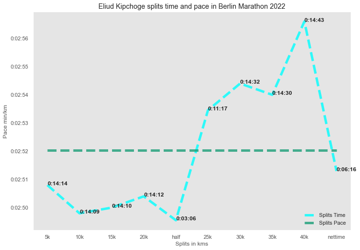

.. image:: https://raw.githubusercontent.com/corriporai/runpandas/master/docs/source/_static/images/runpandas_banner.png

RunPandas - Python Package for handing running data from GPS-enabled devices to worldwide race results.
=======================================================================================================

.. image:: https://img.shields.io/pypi/v/runpandas.svg
    :target: https://pypi.python.org/pypi/runpandas/

.. image:: https://anaconda.org/marcelcaraciolo/runpandas/badges/version.svg
    :target: https://anaconda.org/marcelcaraciolo/runpandas


.. image:: https://img.shields.io/github/issues/corriporai/runpandas.svg
    :target: https://github.com/corriporai/runpandas/issues

.. image:: https://www.codefactor.io/repository/github/corriporai/runpandas/badge
   :target: https://www.codefactor.io/repository/github/corriporai/runpandas
   :alt: CodeFactor

.. image:: https://github.com/corriporai/runpandas/workflows/Build/badge.svg?branch=master
    :target: https://github.com/corriporai/runpandas/actions/workflows/build.yml

.. image:: https://coveralls.io/repos/github/corriporai/runpandas/badge.svg?branch=master
    :target: https://coveralls.io/github/corriporai/runpandas

.. image:: https://codecov.io/gh/corriporai/runpandas/branch/master/graph/badge.svg
  :target: https://codecov.io/gh/corriporai/runpandas

.. image:: https://readthedocs.org/projects/runpandas/badge/?version=latest
    :target: https://runpandas.readthedocs.io/en/latest/?badge=latest

.. image:: https://img.shields.io/badge/code%20style-black-000000.svg
     :target: https://github.com/psf/black

.. image:: https://static.pepy.tech/personalized-badge/runpandas?period=total&units=international_system&left_color=black&right_color=orange&left_text=Downloads
   :target: https://pepy.tech/project/runpandas

.. image:: https://mybinder.org/badge_logo.svg
 :target: https://mybinder.org/v2/gh/corriporai/runpandas/HEAD

.. image:: https://zenodo.org/badge/272209151.svg
   :target: https://zenodo.org/badge/latestdoi/272209151

=========

Introduction
------------

RunPandas is a project to add support for data collected by GPS-enabled tracking devices,
heart rate monitors data to  [pandas](http://pandas.pydata.org) objects.
It is a Python package that provides infrastructure for importing tracking data
from such devices, enabling statistical and visual analysis for running enthusiasts and lovers.
Its goal is to fill the gap between the routine collection of data and their manual analyses in Pandas and Python.

Since the release ``0.6.0`` it comes with the support of handling race event results, so we can analyze
from race split times, finish times, demographics, etc. The goal is to support several many races results available
to anyone interested in running race results analytics.

Documentation
-------------
`Stable documentation `__
is available on
`github.io <https://corriporai.github.io/runpandas/>`__.
A second copy of the stable documentation is hosted on
`read the docs <https://runpandas.readthedocs.io/>`_ for more details.

`Development documentation <https://corriporai.github.io/runpandas/devel/>`__
is available for the latest changes in master.

==> Check out `this Blog post <https://corriporai.github.io/pandasrunner/general/2020/08/01/welcome-to-runpandas.html>`_
for the reasoning and philosophy behind Runpandas, as well as a detailed tutorial with code examples.

==> Follow `this Runpandas live book <https://github.com/corriporai/runpandasbook>`_ in Jupyter notebook format based on `Jupyter Books <https://jupyterbook.org/intro.html>`_.


Install
--------

 RunPandas depends on the following packages:

- ``pandas``
- ``fitparse``
- ``stravalib``
- ``pydantic``
- ``pyaml``
- ``haversine``
- ``thefuzz```

Runpandas was tested to work on \*nix-like systems, including macOS.

-----

Install latest release version via pip
~~~~~~~~~~~~~~~~~~~~~~~~~~~~~~~~~~~~~~

.. code-block:: shell

   $ pip install runpandas

Install latest release version via conda
~~~~~~~~~~~~~~~~~~~~~~~~~~~~~~~~~~~~~~

.. code-block:: shell

   $ conda install -c marcelcaraciolo runpandas


Install latest development version
~~~~~~~~~~~~~~~~~~~~~~~~~~~~~~~~~~

.. code-block:: shell

    $ pip install git+https://github.com/corriporai/runpandas.git

or

.. code-block:: shell

    $ git clone https://github.com/corriporai/runpandas.git
    $ python setup.py install


Examples
--------


Install using ``pip`` and then import and use one of the tracking
readers. This example loads a local file.tcx. From the data file, we
obviously get time, altitude, distance, heart rate and geo position
(lat/long).

.. code:: ipython3

    # !pip install runpandas
    import runpandas as rpd
    activity = rpd.read_file('./sample.tcx')

.. code:: ipython3

    activity.head(5)


.. raw:: html

    <div>
    <style scoped>
        .dataframe tbody tr th:only-of-type {
            vertical-align: middle;
        }
    
        .dataframe tbody tr th {
            vertical-align: top;
        }
    
        .dataframe thead th {
            text-align: right;
        }
    </style>
    <table border="1" class="dataframe">
      <thead>
        <tr style="text-align: right;">
          <th></th>
          <th>alt</th>
          <th>dist</th>
          <th>hr</th>
          <th>lon</th>
          <th>lat</th>
        </tr>
        <tr>
          <th>time</th>
          <th></th>
          <th></th>
          <th></th>
          <th></th>
          <th></th>
        </tr>
      </thead>
      <tbody>
        <tr>
          <th>00:00:00</th>
          <td>178.942627</td>
          <td>0.000000</td>
          <td>62.0</td>
          <td>-79.093187</td>
          <td>35.951880</td>
        </tr>
        <tr>
          <th>00:00:01</th>
          <td>178.942627</td>
          <td>0.000000</td>
          <td>62.0</td>
          <td>-79.093184</td>
          <td>35.951880</td>
        </tr>
        <tr>
          <th>00:00:06</th>
          <td>178.942627</td>
          <td>1.106947</td>
          <td>62.0</td>
          <td>-79.093172</td>
          <td>35.951868</td>
        </tr>
        <tr>
          <th>00:00:12</th>
          <td>177.500610</td>
          <td>13.003035</td>
          <td>62.0</td>
          <td>-79.093228</td>
          <td>35.951774</td>
        </tr>
        <tr>
          <th>00:00:16</th>
          <td>177.500610</td>
          <td>22.405027</td>
          <td>60.0</td>
          <td>-79.093141</td>
          <td>35.951732</td>
        </tr>
      </tbody>
    </table>
    </div>


The data frames that are returned by runpandas when loading files is
similar for different file types. The dataframe in the above example is
a subclass of the ``pandas.DataFrame`` and provides some additional
features. Certain columns also return specific ``pandas.Series``
subclasses, which provides useful methods:

.. code:: ipython3

    print (type(activity))
    print(type(activity.alt))


.. parsed-literal::

    <class 'runpandas.types.frame.Activity'>
    <class 'runpandas.types.columns.Altitude'>


For instance, if you want to get the base unit for the altitude ``alt``
data or the distance ``dist`` data:

.. code:: ipython3

    print(activity.alt.base_unit)
    print(activity.alt.sum())


.. parsed-literal::

    m
    65883.68151855901


.. code:: ipython3

    print(activity.dist.base_unit)
    print(activity.dist[-1])


.. parsed-literal::

    m
    4686.31103516


The ``Activity`` dataframe also contains special properties that
presents some statistics from the workout such as elapsed time, mean
heartrate, the moving time and the distance of workout in meters.

.. code:: ipython3

    #total time elapsed for the activity
    print(activity.ellapsed_time)
    #distance of workout in meters
    print(activity.distance)
    #mean heartrate
    print(activity.mean_heart_rate())


.. parsed-literal::

    0 days 00:33:11
    4686.31103516
    156.65274151436032


Occasionally, some observations such as speed, distance and others must
be calculated based on available data in the given activity. In
runpandas there are special accessors (``runpandas.acessors``) that
computes some of these metrics. We will compute the ``speed`` and the
``distance per position`` observations using the latitude and longitude
for each record and calculate the haversine distance in meters and the
speed in meters per second.

.. code:: ipython3

    #compute the distance using haversine formula between two consecutive latitude, longitudes observations.
    activity['distpos']  = activity.compute.distance()
    activity['distpos'].head()


.. parsed-literal::

    time
    00:00:00          NaN
    00:00:01     0.333146
    00:00:06     1.678792
    00:00:12    11.639901
    00:00:16     9.183847
    Name: distpos, dtype: float64


.. code:: ipython3

    #compute the distance using haversine formula between two consecutive latitude, longitudes observations.
    activity['speed']  = activity.compute.speed(from_distances=True)
    activity['speed'].head()


.. parsed-literal::

    time
    00:00:00         NaN
    00:00:01    0.333146
    00:00:06    0.335758
    00:00:12    1.939984
    00:00:16    2.295962
    Name: speed, dtype: float64


Popular running metrics are also available through the runpandas
acessors such as gradient, pace, vertical speed , etc.

.. code:: ipython3

    activity['vam'] = activity.compute.vertical_speed()
    activity['vam'].head()


.. parsed-literal::

    time
    00:00:00         NaN
    00:00:01    0.000000
    00:00:06    0.000000
    00:00:12   -0.240336
    00:00:16    0.000000
    Name: vam, dtype: float64


Sporadically, there will be a large time difference between consecutive
observations in the same workout. This can happen when device is paused
by the athlete or therere proprietary algorithms controlling the
operating sampling rate of the device which can auto-pause when the
device detects no significant change in position. In runpandas there is
an algorithm that will attempt to calculate the moving time based on the
GPS locations, distances, and speed of the activity.

To compute the moving time, there is a special acessor that detects the
periods of inactivity and returns the ``moving`` series containing all
the observations considered to be stopped.

.. code:: ipython3

    activity_only_moving = activity.only_moving()
    print(activity_only_moving['moving'].head())


.. parsed-literal::

    time
    00:00:00    False
    00:00:01    False
    00:00:06    False
    00:00:12     True
    00:00:16     True
    Name: moving, dtype: bool


Now we can compute the moving time, the time of how long the user were
active.

.. code:: ipython3

    activity_only_moving.moving_time


.. parsed-literal::

    Timedelta('0 days 00:33:05')


Runpandas also provides a method ``summary`` for summarising the
activity through common statistics. Such a session summary includes
estimates of several metrics computed above with a single call.

.. code:: ipython3

    activity_only_moving.summary()


.. parsed-literal::

    Session                           Running: 26-12-2012 21:29:53
    Total distance (meters)                                4686.31
    Total ellapsed time                            0 days 00:33:11
    Total moving time                              0 days 00:33:05
    Average speed (km/h)                                   8.47656
    Average moving speed (km/h)                            8.49853
    Average pace (per 1 km)                        0 days 00:07:04
    Average pace moving (per 1 km)                 0 days 00:07:03
    Average cadence                                            NaN
    Average moving cadence                                     NaN
    Average heart rate                                     156.653
    Average moving heart rate                                157.4
    Average temperature                                        NaN
    dtype: object


Now, let’s play with the data. Let’s show distance vs as an example of
what and how we can create visualizations. In this example, we will use
the built in, matplotlib based plot function.

.. code:: ipython3

    activity[['dist']].plot()


.. parsed-literal::

    Matplotlib is building the font cache; this may take a moment.


.. parsed-literal::

    <AxesSubplot:xlabel='time'>


.. image:: examples/overview_files/overview_10_2.svg


And here is altitude versus time.

.. code:: ipython3

    activity[['alt']].plot()


.. parsed-literal::

    <AxesSubplot:xlabel='time'>


.. image:: examples/overview_files/overview_12_1.svg


Finally, lest’s show the altitude vs distance profile. Here is a
scatterplot that shows altitude vs distance as recorded.

.. code:: ipython3

    activity.plot.scatter(x='dist', y='alt', c='DarkBlue')


.. parsed-literal::

    <AxesSubplot:xlabel='dist', ylabel='alt'>


.. image:: examples/overview_files/overview_14_1.svg


Finally, let’s watch a glimpse of the map route by plotting a 2d map
using logintude vs latitude.

.. code:: ipython3

    activity.plot(x='lon', y='lat')


.. parsed-literal::

    <AxesSubplot:xlabel='lon'>


.. image:: examples/overview_files/overview_16_1.svg


The ``runpandas`` package also comes with extra batteries, such as our
``runpandas.datasets`` package, which includes a range of example data
for testing purposes. There is a dedicated
`repository <https://github.com/corriporai/runpandas-data>`__ with all
the data available. An index of the data is kept
`here <https://github.com/corriporai/runpandas-data/blob/master/activities/index.yml>`__.

You can use the example data available:

.. code:: ipython3

    example_fit = rpd.activity_examples(path='Garmin_Fenix_6S_Pro-Running.fit')
    print(example_fit.summary)
    print('Included metrics:', example_fit.included_data)


.. parsed-literal::

    Synced from watch Garmin Fenix 6S
    
    Included metrics: [<MetricsEnum.latitude: 'latitude'>, <MetricsEnum.longitude: 'longitude'>, <MetricsEnum.elevation: 'elevation'>, <MetricsEnum.heartrate: 'heartrate'>, <MetricsEnum.cadence: 'cadence'>, <MetricsEnum.distance: 'distance'>, <MetricsEnum.temperature: 'temperature'>]


.. code:: ipython3

    rpd.read_file(example_fit.path).head()


.. raw:: html

    <div>
    <style scoped>
        .dataframe tbody tr th:only-of-type {
            vertical-align: middle;
        }
    
        .dataframe tbody tr th {
            vertical-align: top;
        }
    
        .dataframe thead th {
            text-align: right;
        }
    </style>
    <table border="1" class="dataframe">
      <thead>
        <tr style="text-align: right;">
          <th></th>
          <th>enhanced_speed</th>
          <th>enhanced_altitude</th>
          <th>unknown_87</th>
          <th>fractional_cadence</th>
          <th>lap</th>
          <th>session</th>
          <th>unknown_108</th>
          <th>dist</th>
          <th>cad</th>
          <th>hr</th>
          <th>lon</th>
          <th>lat</th>
          <th>temp</th>
        </tr>
        <tr>
          <th>time</th>
          <th></th>
          <th></th>
          <th></th>
          <th></th>
          <th></th>
          <th></th>
          <th></th>
          <th></th>
          <th></th>
          <th></th>
          <th></th>
          <th></th>
          <th></th>
        </tr>
      </thead>
      <tbody>
        <tr>
          <th>00:00:00</th>
          <td>0.000</td>
          <td>254.0</td>
          <td>0</td>
          <td>0.0</td>
          <td>0</td>
          <td>0</td>
          <td>NaN</td>
          <td>0.00</td>
          <td>0</td>
          <td>101</td>
          <td>13.843376</td>
          <td>51.066280</td>
          <td>8</td>
        </tr>
        <tr>
          <th>00:00:01</th>
          <td>0.000</td>
          <td>254.0</td>
          <td>0</td>
          <td>0.0</td>
          <td>0</td>
          <td>0</td>
          <td>NaN</td>
          <td>0.00</td>
          <td>0</td>
          <td>101</td>
          <td>13.843374</td>
          <td>51.066274</td>
          <td>8</td>
        </tr>
        <tr>
          <th>00:00:10</th>
          <td>1.698</td>
          <td>254.0</td>
          <td>0</td>
          <td>0.0</td>
          <td>0</td>
          <td>1</td>
          <td>2362.0</td>
          <td>0.00</td>
          <td>83</td>
          <td>97</td>
          <td>13.843176</td>
          <td>51.066249</td>
          <td>8</td>
        </tr>
        <tr>
          <th>00:00:12</th>
          <td>2.267</td>
          <td>254.0</td>
          <td>0</td>
          <td>0.0</td>
          <td>0</td>
          <td>1</td>
          <td>2362.0</td>
          <td>3.95</td>
          <td>84</td>
          <td>99</td>
          <td>13.843118</td>
          <td>51.066250</td>
          <td>8</td>
        </tr>
        <tr>
          <th>00:00:21</th>
          <td>2.127</td>
          <td>254.6</td>
          <td>0</td>
          <td>0.5</td>
          <td>0</td>
          <td>1</td>
          <td>2552.0</td>
          <td>16.67</td>
          <td>87</td>
          <td>100</td>
          <td>13.842940</td>
          <td>51.066231</td>
          <td>8</td>
        </tr>
      </tbody>
    </table>
    </div>


In case of you just only want to see all the activities in a specific
file type , you can filter the ``runpandas.activities_examples``, which
returns a filter iterable that you can iterate over:

.. code:: ipython3

    fit_examples = rpd.activity_examples(file_type=rpd.FileTypeEnum.FIT)
    for example in fit_examples:
        #Download and play with the filtered examples
        print(example.path)


.. parsed-literal::

    https://raw.githubusercontent.com/corriporai/runpandas-data/master/activities/Garmin_Fenix_6S_Pro-Running.fit
    https://raw.githubusercontent.com/corriporai/runpandas-data/master/activities/Garmin_Fenix2_running_with_hrm.fit
    https://raw.githubusercontent.com/corriporai/runpandas-data/master/activities/Garmin_Forerunner_910XT-Running.fit


Exploring sessions
==================

The package ``runpandas`` provides utilities to import a group of
activities data, and after careful processing, organises them into a
MultiIndex Dataframe.

The ``pandas.MultiIndex`` allows you to have multiple columns acting as
a row identifier and multiple rows acting as a header identifier. In our
scenario we will have as first indentifier (index) the timestamp of the
workout when it started, and as second indentifier the timedelta of the
consecutive observations of the workout.



   The MultiIndex Runpandas Activity Dataframe

The MultiIndex dataframe result from the function
``runpandas.read_dir_aggregate``, which takes as input the directory of
tracking data files, and constructs using the read*() functions to build
``runpandas.Activity`` objects. Them, the result daframes are first
sorted by the time stamps and are all combined into a single
``runpandas.Activity`` indexed by the two-level ``pandas.MultiIndex``.

Let’s illustrate these examples by loading a bunch of 68 running
activities of a female runner over the years of 2020 until 2021.

.. code:: ipython3

    import warnings
    warnings.filterwarnings('ignore')

.. code:: ipython3

    import runpandas
    session = runpandas.read_dir_aggregate(dirname='session/')

.. code:: ipython3

    session


.. raw:: html

    <div>
    <style scoped>
        .dataframe tbody tr th:only-of-type {
            vertical-align: middle;
        }
    
        .dataframe tbody tr th {
            vertical-align: top;
        }
    
        .dataframe thead th {
            text-align: right;
        }
    </style>
    <table border="1" class="dataframe">
      <thead>
        <tr style="text-align: right;">
          <th></th>
          <th></th>
          <th>alt</th>
          <th>hr</th>
          <th>lon</th>
          <th>lat</th>
        </tr>
        <tr>
          <th>start</th>
          <th>time</th>
          <th></th>
          <th></th>
          <th></th>
          <th></th>
        </tr>
      </thead>
      <tbody>
        <tr>
          <th rowspan="5" valign="top">2020-08-30 09:08:51.012</th>
          <th>00:00:00</th>
          <td>NaN</td>
          <td>NaN</td>
          <td>-34.893609</td>
          <td>-8.045055</td>
        </tr>
        <tr>
          <th>00:00:01.091000</th>
          <td>NaN</td>
          <td>NaN</td>
          <td>-34.893624</td>
          <td>-8.045054</td>
        </tr>
        <tr>
          <th>00:00:02.091000</th>
          <td>NaN</td>
          <td>NaN</td>
          <td>-34.893641</td>
          <td>-8.045061</td>
        </tr>
        <tr>
          <th>00:00:03.098000</th>
          <td>NaN</td>
          <td>NaN</td>
          <td>-34.893655</td>
          <td>-8.045063</td>
        </tr>
        <tr>
          <th>00:00:04.098000</th>
          <td>NaN</td>
          <td>NaN</td>
          <td>-34.893655</td>
          <td>-8.045065</td>
        </tr>
        <tr>
          <th>...</th>
          <th>...</th>
          <td>...</td>
          <td>...</td>
          <td>...</td>
          <td>...</td>
        </tr>
        <tr>
          <th rowspan="5" valign="top">2021-07-04 11:23:19.418</th>
          <th>00:52:39.582000</th>
          <td>0.050001</td>
          <td>189.0</td>
          <td>-34.894534</td>
          <td>-8.046602</td>
        </tr>
        <tr>
          <th>00:52:43.582000</th>
          <td>NaN</td>
          <td>NaN</td>
          <td>-34.894465</td>
          <td>-8.046533</td>
        </tr>
        <tr>
          <th>00:52:44.582000</th>
          <td>NaN</td>
          <td>NaN</td>
          <td>-34.894443</td>
          <td>-8.046515</td>
        </tr>
        <tr>
          <th>00:52:45.582000</th>
          <td>NaN</td>
          <td>NaN</td>
          <td>-34.894429</td>
          <td>-8.046494</td>
        </tr>
        <tr>
          <th>00:52:49.582000</th>
          <td>NaN</td>
          <td>190.0</td>
          <td>-34.894395</td>
          <td>-8.046398</td>
        </tr>
      </tbody>
    </table>
    <p>48794 rows × 4 columns</p>
    </div>


Now let’s see how many activities there are available for analysis. For
this question, we also have an acessor
``runpandas.types.acessors.session._SessionAcessor`` that holds several
methods for computing the basic running metrics across all the
activities from this kind of frame and some summary statistics.

.. code:: ipython3

    #count the number of activities in the session
    print ('Total Activities:', session.session.count())


.. parsed-literal::

    Total Activities: 68


We might compute the main running metrics (speed, pace, moving, etc)
using the session acessors methods as like the ones available in the
``runpandas.types.metrics.MetricsAcessor`` . By the way, those methods
are called inside each metric method, but applying in each of activities
separatedely.

.. code:: ipython3

    #In this example we compute the distance and the distance per position across all workouts
    session = session.session.distance()
    session


.. raw:: html

    <div>
    <style scoped>
        .dataframe tbody tr th:only-of-type {
            vertical-align: middle;
        }
    
        .dataframe tbody tr th {
            vertical-align: top;
        }
    
        .dataframe thead th {
            text-align: right;
        }
    </style>
    <table border="1" class="dataframe">
      <thead>
        <tr style="text-align: right;">
          <th></th>
          <th></th>
          <th>alt</th>
          <th>hr</th>
          <th>lon</th>
          <th>lat</th>
          <th>distpos</th>
          <th>dist</th>
        </tr>
        <tr>
          <th>start</th>
          <th>time</th>
          <th></th>
          <th></th>
          <th></th>
          <th></th>
          <th></th>
          <th></th>
        </tr>
      </thead>
      <tbody>
        <tr>
          <th rowspan="5" valign="top">2020-08-30 09:08:51.012</th>
          <th>00:00:00</th>
          <td>NaN</td>
          <td>NaN</td>
          <td>-34.893609</td>
          <td>-8.045055</td>
          <td>NaN</td>
          <td>NaN</td>
        </tr>
        <tr>
          <th>00:00:01.091000</th>
          <td>NaN</td>
          <td>NaN</td>
          <td>-34.893624</td>
          <td>-8.045054</td>
          <td>1.690587</td>
          <td>1.690587</td>
        </tr>
        <tr>
          <th>00:00:02.091000</th>
          <td>NaN</td>
          <td>NaN</td>
          <td>-34.893641</td>
          <td>-8.045061</td>
          <td>2.095596</td>
          <td>3.786183</td>
        </tr>
        <tr>
          <th>00:00:03.098000</th>
          <td>NaN</td>
          <td>NaN</td>
          <td>-34.893655</td>
          <td>-8.045063</td>
          <td>1.594298</td>
          <td>5.380481</td>
        </tr>
        <tr>
          <th>00:00:04.098000</th>
          <td>NaN</td>
          <td>NaN</td>
          <td>-34.893655</td>
          <td>-8.045065</td>
          <td>0.163334</td>
          <td>5.543815</td>
        </tr>
        <tr>
          <th>...</th>
          <th>...</th>
          <td>...</td>
          <td>...</td>
          <td>...</td>
          <td>...</td>
          <td>...</td>
          <td>...</td>
        </tr>
        <tr>
          <th rowspan="5" valign="top">2021-07-04 11:23:19.418</th>
          <th>00:52:39.582000</th>
          <td>0.050001</td>
          <td>189.0</td>
          <td>-34.894534</td>
          <td>-8.046602</td>
          <td>12.015437</td>
          <td>8220.018885</td>
        </tr>
        <tr>
          <th>00:52:43.582000</th>
          <td>NaN</td>
          <td>NaN</td>
          <td>-34.894465</td>
          <td>-8.046533</td>
          <td>10.749779</td>
          <td>8230.768664</td>
        </tr>
        <tr>
          <th>00:52:44.582000</th>
          <td>NaN</td>
          <td>NaN</td>
          <td>-34.894443</td>
          <td>-8.046515</td>
          <td>3.163638</td>
          <td>8233.932302</td>
        </tr>
        <tr>
          <th>00:52:45.582000</th>
          <td>NaN</td>
          <td>NaN</td>
          <td>-34.894429</td>
          <td>-8.046494</td>
          <td>2.851535</td>
          <td>8236.783837</td>
        </tr>
        <tr>
          <th>00:52:49.582000</th>
          <td>NaN</td>
          <td>190.0</td>
          <td>-34.894395</td>
          <td>-8.046398</td>
          <td>11.300740</td>
          <td>8248.084577</td>
        </tr>
      </tbody>
    </table>
    <p>48794 rows × 6 columns</p>
    </div>


.. code:: ipython3

    #comput the speed for each activity
    session = session.session.speed(from_distances=True)
    #compute the pace for each activity
    session = session.session.pace()
    #compute the inactivity periods for each activity
    session = session.session.only_moving()

After all the computation done, let’s going to the next step: the
exploration and get some descriptive statistics.

After the loading and metrics computation for all the activities, now
let’s look further the data and get the basic summaries about the
session: time spent, total distance, mean speed and other insightful
statistics in each running activity. For this task, we may accomplish it
by calling the method
``runpandas.types.session._SessionAcessor.summarize`` . It will return a
basic Dataframe including all the aggregated statistics per activity
from the season frame.

.. code:: ipython3

    summary = session.session.summarize()
    summary


.. raw:: html

    <div>
    <style scoped>
        .dataframe tbody tr th:only-of-type {
            vertical-align: middle;
        }
    
        .dataframe tbody tr th {
            vertical-align: top;
        }
    
        .dataframe thead th {
            text-align: right;
        }
    </style>
    <table border="1" class="dataframe">
      <thead>
        <tr style="text-align: right;">
          <th></th>
          <th>moving_time</th>
          <th>mean_speed</th>
          <th>max_speed</th>
          <th>mean_pace</th>
          <th>max_pace</th>
          <th>mean_moving_speed</th>
          <th>mean_moving_pace</th>
          <th>mean_cadence</th>
          <th>max_cadence</th>
          <th>mean_moving_cadence</th>
          <th>mean_heart_rate</th>
          <th>max_heart_rate</th>
          <th>mean_moving_heart_rate</th>
          <th>mean_temperature</th>
          <th>min_temperature</th>
          <th>max_temperature</th>
          <th>total_distance</th>
          <th>ellapsed_time</th>
        </tr>
        <tr>
          <th>start</th>
          <th></th>
          <th></th>
          <th></th>
          <th></th>
          <th></th>
          <th></th>
          <th></th>
          <th></th>
          <th></th>
          <th></th>
          <th></th>
          <th></th>
          <th></th>
          <th></th>
          <th></th>
          <th></th>
          <th></th>
          <th></th>
        </tr>
      </thead>
      <tbody>
        <tr>
          <th>2020-07-03 09:50:53.162</th>
          <td>00:25:29.838000</td>
          <td>2.642051</td>
          <td>4.879655</td>
          <td>00:06:18</td>
          <td>00:03:24</td>
          <td>2.665008</td>
          <td>00:06:15</td>
          <td>NaN</td>
          <td>NaN</td>
          <td>NaN</td>
          <td>178.819923</td>
          <td>188.0</td>
          <td>178.872587</td>
          <td>NaN</td>
          <td>NaN</td>
          <td>NaN</td>
          <td>4089.467333</td>
          <td>00:25:47.838000</td>
        </tr>
        <tr>
          <th>2020-07-05 09:33:20.999</th>
          <td>00:05:04.999000</td>
          <td>2.227637</td>
          <td>6.998021</td>
          <td>00:07:28</td>
          <td>00:02:22</td>
          <td>3.072098</td>
          <td>00:05:25</td>
          <td>NaN</td>
          <td>NaN</td>
          <td>NaN</td>
          <td>168.345455</td>
          <td>176.0</td>
          <td>168.900000</td>
          <td>NaN</td>
          <td>NaN</td>
          <td>NaN</td>
          <td>980.162640</td>
          <td>00:07:20.001000</td>
        </tr>
        <tr>
          <th>2020-07-05 09:41:59.999</th>
          <td>00:18:19</td>
          <td>1.918949</td>
          <td>6.563570</td>
          <td>00:08:41</td>
          <td>00:02:32</td>
          <td>2.729788</td>
          <td>00:06:06</td>
          <td>NaN</td>
          <td>NaN</td>
          <td>NaN</td>
          <td>173.894180</td>
          <td>185.0</td>
          <td>174.577143</td>
          <td>NaN</td>
          <td>NaN</td>
          <td>NaN</td>
          <td>3139.401118</td>
          <td>00:27:16</td>
        </tr>
        <tr>
          <th>2020-07-13 09:13:58.718</th>
          <td>00:40:21.281000</td>
          <td>2.509703</td>
          <td>8.520387</td>
          <td>00:06:38</td>
          <td>00:01:57</td>
          <td>2.573151</td>
          <td>00:06:28</td>
          <td>NaN</td>
          <td>NaN</td>
          <td>NaN</td>
          <td>170.808176</td>
          <td>185.0</td>
          <td>170.795527</td>
          <td>NaN</td>
          <td>NaN</td>
          <td>NaN</td>
          <td>6282.491059</td>
          <td>00:41:43.281000</td>
        </tr>
        <tr>
          <th>2020-07-17 09:33:02.308</th>
          <td>00:32:07.691000</td>
          <td>2.643278</td>
          <td>8.365431</td>
          <td>00:06:18</td>
          <td>00:01:59</td>
          <td>2.643278</td>
          <td>00:06:18</td>
          <td>NaN</td>
          <td>NaN</td>
          <td>NaN</td>
          <td>176.436242</td>
          <td>186.0</td>
          <td>176.436242</td>
          <td>NaN</td>
          <td>NaN</td>
          <td>NaN</td>
          <td>5095.423045</td>
          <td>00:32:07.691000</td>
        </tr>
        <tr>
          <th>...</th>
          <td>...</td>
          <td>...</td>
          <td>...</td>
          <td>...</td>
          <td>...</td>
          <td>...</td>
          <td>...</td>
          <td>...</td>
          <td>...</td>
          <td>...</td>
          <td>...</td>
          <td>...</td>
          <td>...</td>
          <td>...</td>
          <td>...</td>
          <td>...</td>
          <td>...</td>
          <td>...</td>
        </tr>
        <tr>
          <th>2021-06-13 09:22:30.985</th>
          <td>01:32:33.018000</td>
          <td>2.612872</td>
          <td>23.583956</td>
          <td>00:06:22</td>
          <td>00:00:42</td>
          <td>2.810855</td>
          <td>00:05:55</td>
          <td>NaN</td>
          <td>NaN</td>
          <td>NaN</td>
          <td>169.340812</td>
          <td>183.0</td>
          <td>169.655879</td>
          <td>NaN</td>
          <td>NaN</td>
          <td>NaN</td>
          <td>15706.017295</td>
          <td>01:40:11.016000</td>
        </tr>
        <tr>
          <th>2021-06-20 09:16:55.163</th>
          <td>00:59:44.512000</td>
          <td>2.492640</td>
          <td>6.065895</td>
          <td>00:06:41</td>
          <td>00:02:44</td>
          <td>2.749453</td>
          <td>00:06:03</td>
          <td>NaN</td>
          <td>NaN</td>
          <td>NaN</td>
          <td>170.539809</td>
          <td>190.0</td>
          <td>171.231392</td>
          <td>NaN</td>
          <td>NaN</td>
          <td>NaN</td>
          <td>9965.168311</td>
          <td>01:06:37.837000</td>
        </tr>
        <tr>
          <th>2021-06-23 09:37:44.000</th>
          <td>00:26:49.001000</td>
          <td>2.501796</td>
          <td>5.641343</td>
          <td>00:06:39</td>
          <td>00:02:57</td>
          <td>2.568947</td>
          <td>00:06:29</td>
          <td>NaN</td>
          <td>NaN</td>
          <td>NaN</td>
          <td>156.864865</td>
          <td>171.0</td>
          <td>156.957031</td>
          <td>NaN</td>
          <td>NaN</td>
          <td>NaN</td>
          <td>4165.492241</td>
          <td>00:27:45.001000</td>
        </tr>
        <tr>
          <th>2021-06-27 09:50:08.664</th>
          <td>00:31:42.336000</td>
          <td>2.646493</td>
          <td>32.734124</td>
          <td>00:06:17</td>
          <td>00:00:30</td>
          <td>2.661853</td>
          <td>00:06:15</td>
          <td>NaN</td>
          <td>NaN</td>
          <td>NaN</td>
          <td>166.642857</td>
          <td>176.0</td>
          <td>166.721116</td>
          <td>NaN</td>
          <td>NaN</td>
          <td>NaN</td>
          <td>5074.217061</td>
          <td>00:31:57.336000</td>
        </tr>
        <tr>
          <th>2021-07-04 11:23:19.418</th>
          <td>00:47:47.583000</td>
          <td>2.602263</td>
          <td>4.212320</td>
          <td>00:06:24</td>
          <td>00:03:57</td>
          <td>2.856801</td>
          <td>00:05:50</td>
          <td>NaN</td>
          <td>NaN</td>
          <td>NaN</td>
          <td>177.821862</td>
          <td>192.0</td>
          <td>177.956967</td>
          <td>NaN</td>
          <td>NaN</td>
          <td>NaN</td>
          <td>8248.084577</td>
          <td>00:52:49.582000</td>
        </tr>
      </tbody>
    </table>
    <p>68 rows × 18 columns</p>
    </div>


.. code:: ipython3

    print('Session Interval:', (summary.index.to_series().max() - summary.index.to_series().min()).days, 'days')
    print('Total Workouts:', len(summary), 'runnings')
    print('Tota KM Distance:', summary['total_distance'].sum() / 1000)
    print('Average Pace (all runs):', summary.mean_pace.mean())
    print('Average Moving Pace (all runs):', summary.mean_moving_pace.mean())
    print('Average KM Distance (all runs):', round(summary.total_distance.mean()/ 1000,2))


.. parsed-literal::

    Session Interval: 366 days
    Total Workouts: 68 runnings
    Tota KM Distance: 491.77377537338896
    Average Pace (all runs): 0 days 00:07:18.411764
    Average Moving Pace (all runs): 0 days 00:06:02.147058
    Average KM Distance (all runs): 7.23


At this point, I have the summary data to start some powerful
visualization and analysis. At the charts below we illustrate her pace
and distance evolution over time.

.. code:: ipython3

    import matplotlib.pyplot as plt
    import datetime
    
    #let's convert the pace to float number in minutes
    summary['mean_moving_pace_float'] = summary['mean_moving_pace'] / datetime.timedelta(minutes=1)
    summary['pace_moving_all_mean'] = summary.mean_moving_pace.mean()
    summary['pace_moving_all_mean_float'] = summary['pace_moving_all_mean'] / datetime.timedelta(minutes=1)
    
    plt.subplots(figsize=(8, 5))
    
    plt.plot(summary.index, summary.mean_moving_pace_float, color='silver')
    plt.plot(summary.pace_moving_all_mean_float, color='purple', linestyle='dashed', label='average')
    plt.title("Pace Evolution")
    plt.xlabel("Runnings")
    plt.ylabel("Pace")
    plt.legend()


.. parsed-literal::

    <matplotlib.legend.Legend at 0x7f82d8d83cd0>





.. code:: ipython3

    
    plt.subplots(figsize=(8, 5))
    
    summary['distance_all_mean'] = round(summary.total_distance.mean()/1000,2)
    
    plt.plot(summary.index, summary.total_distance / 1000, color='silver')
    plt.plot(summary.distance_all_mean, color='purple', linestyle='dashed', label='average')
    plt.title("Distance Evolution")
    plt.xlabel("Runs")
    plt.ylabel("distance")
    plt.legend()
    
    
    plt.show()




Accessing historical data from running race results
===================================================

One of the great features in Runpandas is the capability of accessing
race’s result datasets accross several races around the world,
from majors to local ones (if it’s available at our data repository).
In this example we will analyze the 2022 Berlin Marathon using runpandas
methods specially tailored for handling race results data.

First, let’s load the Berlin Marathon data by using the runpandas method
``runpandas.get_events``. This function provides a way of accessing the
race data and visualize the results from several marathons available at
our datasets repository. Given the year and the marathon identifier you
can filter any marathon datasets that you want analyze. The result will
be a list of ``runpandas.EventData`` instances with race result and its
metadata. Let’s look for Berlin Marathon results.


.. code:: ipython3

    import pandas as pd
    import runpandas as rpd
    import warnings
    warnings.filterwarnings('ignore')

.. code:: ipython3

    results = rpd.get_events('Berlin')
    results


.. parsed-literal::

    [<Event: name=Berlin Marathon Results from 2022., country=DE, edition=2022>]


The result comes with the Berlin Marathon Result from 2022. Let’s take a
look inside the race event, which comes with a handful method to
describe its attributes and a special method to load the race result
data into a ``runpandas.datasets.schema.RaceData`` instance.

.. code:: ipython3

    berlin_result = results[0]
    print('Event type', berlin_result.run_type)
    print('Country', berlin_result.country)
    print('Year', berlin_result.edition)
    print('Name', berlin_result.summary)


.. parsed-literal::

    Event type RunTypeEnum.MARATHON
    Country DE
    Year 2022
    Name Berlin Marathon Results from 2022.
    


Now that we confirmed that we requested the corresponding marathon
dataset. We will load it into a DataFrame so we can further explore it.

.. code:: ipython3

    #loading the race data into a RaceData Dataframe
    race_result = berlin_result.load()
    race_result


.. raw:: html

    <div>
    <style scoped>
        .dataframe tbody tr th:only-of-type {
            vertical-align: middle;
        }
    
        .dataframe tbody tr th {
            vertical-align: top;
        }
    
        .dataframe thead th {
            text-align: right;
        }
    </style>
    <table border="1" class="dataframe">
      <thead>
        <tr style="text-align: right;">
          <th></th>
          <th>position</th>
          <th>position_gender</th>
          <th>country</th>
          <th>sex</th>
          <th>division</th>
          <th>bib</th>
          <th>firstname</th>
          <th>lastname</th>
          <th>club</th>
          <th>starttime</th>
          <th>...</th>
          <th>10k</th>
          <th>15k</th>
          <th>20k</th>
          <th>25k</th>
          <th>30k</th>
          <th>35k</th>
          <th>40k</th>
          <th>grosstime</th>
          <th>nettime</th>
          <th>category</th>
        </tr>
      </thead>
      <tbody>
        <tr>
          <th>0</th>
          <td>1</td>
          <td>1</td>
          <td>KEN</td>
          <td>M</td>
          <td>1</td>
          <td>1</td>
          <td>Eliud</td>
          <td>Kipchoge</td>
          <td>–</td>
          <td>09:15:00</td>
          <td>...</td>
          <td>0 days 00:28:23</td>
          <td>0 days 00:42:33</td>
          <td>0 days 00:56:45</td>
          <td>0 days 01:11:08</td>
          <td>0 days 01:25:40</td>
          <td>0 days 01:40:10</td>
          <td>0 days 01:54:53</td>
          <td>0 days 02:01:09</td>
          <td>0 days 02:01:09</td>
          <td>M35</td>
        </tr>
        <tr>
          <th>1</th>
          <td>2</td>
          <td>2</td>
          <td>KEN</td>
          <td>M</td>
          <td>1</td>
          <td>5</td>
          <td>Mark</td>
          <td>Korir</td>
          <td>–</td>
          <td>09:15:00</td>
          <td>...</td>
          <td>0 days 00:28:56</td>
          <td>0 days 00:43:35</td>
          <td>0 days 00:58:14</td>
          <td>0 days 01:13:07</td>
          <td>0 days 01:28:06</td>
          <td>0 days 01:43:25</td>
          <td>0 days 01:59:05</td>
          <td>0 days 02:05:58</td>
          <td>0 days 02:05:58</td>
          <td>M30</td>
        </tr>
        <tr>
          <th>2</th>
          <td>3</td>
          <td>3</td>
          <td>ETH</td>
          <td>M</td>
          <td>1</td>
          <td>8</td>
          <td>Tadu</td>
          <td>Abate</td>
          <td>–</td>
          <td>09:15:00</td>
          <td>...</td>
          <td>0 days 00:29:46</td>
          <td>0 days 00:44:40</td>
          <td>0 days 00:59:40</td>
          <td>0 days 01:14:44</td>
          <td>0 days 01:30:01</td>
          <td>0 days 01:44:55</td>
          <td>0 days 02:00:03</td>
          <td>0 days 02:06:28</td>
          <td>0 days 02:06:28</td>
          <td>MH</td>
        </tr>
        <tr>
          <th>3</th>
          <td>4</td>
          <td>4</td>
          <td>ETH</td>
          <td>M</td>
          <td>2</td>
          <td>26</td>
          <td>Andamlak</td>
          <td>Belihu</td>
          <td>–</td>
          <td>09:15:00</td>
          <td>...</td>
          <td>0 days 00:28:23</td>
          <td>0 days 00:42:33</td>
          <td>0 days 00:56:45</td>
          <td>0 days 01:11:09</td>
          <td>0 days 01:26:11</td>
          <td>0 days 01:42:14</td>
          <td>0 days 01:59:14</td>
          <td>0 days 02:06:40</td>
          <td>0 days 02:06:40</td>
          <td>MH</td>
        </tr>
        <tr>
          <th>4</th>
          <td>5</td>
          <td>5</td>
          <td>KEN</td>
          <td>M</td>
          <td>3</td>
          <td>25</td>
          <td>Abel</td>
          <td>Kipchumba</td>
          <td>–</td>
          <td>09:15:00</td>
          <td>...</td>
          <td>0 days 00:28:55</td>
          <td>0 days 00:43:35</td>
          <td>0 days 00:58:14</td>
          <td>0 days 01:13:07</td>
          <td>0 days 01:28:03</td>
          <td>0 days 01:43:08</td>
          <td>0 days 01:59:14</td>
          <td>0 days 02:06:49</td>
          <td>0 days 02:06:49</td>
          <td>MH</td>
        </tr>
        <tr>
          <th>...</th>
          <td>...</td>
          <td>...</td>
          <td>...</td>
          <td>...</td>
          <td>...</td>
          <td>...</td>
          <td>...</td>
          <td>...</td>
          <td>...</td>
          <td>...</td>
          <td>...</td>
          <td>...</td>
          <td>...</td>
          <td>...</td>
          <td>...</td>
          <td>...</td>
          <td>...</td>
          <td>...</td>
          <td>...</td>
          <td>...</td>
          <td>...</td>
        </tr>
        <tr>
          <th>35566</th>
          <td>DNF</td>
          <td>–</td>
          <td>USA</td>
          <td>M</td>
          <td>–</td>
          <td>65079</td>
          <td>michael</td>
          <td>perkowski</td>
          <td>–</td>
          <td>–</td>
          <td>...</td>
          <td>NaT</td>
          <td>NaT</td>
          <td>NaT</td>
          <td>NaT</td>
          <td>NaT</td>
          <td>NaT</td>
          <td>NaT</td>
          <td>NaT</td>
          <td>NaT</td>
          <td>M65</td>
        </tr>
        <tr>
          <th>35567</th>
          <td>DNF</td>
          <td>–</td>
          <td>USA</td>
          <td>M</td>
          <td>–</td>
          <td>62027</td>
          <td>Karl</td>
          <td>Mann</td>
          <td>–</td>
          <td>–</td>
          <td>...</td>
          <td>NaT</td>
          <td>NaT</td>
          <td>NaT</td>
          <td>NaT</td>
          <td>NaT</td>
          <td>NaT</td>
          <td>NaT</td>
          <td>NaT</td>
          <td>NaT</td>
          <td>M55</td>
        </tr>
        <tr>
          <th>35568</th>
          <td>DNF</td>
          <td>–</td>
          <td>THA</td>
          <td>F</td>
          <td>–</td>
          <td>27196</td>
          <td>oraluck</td>
          <td>pichaiwongse</td>
          <td>STATE to BERLIN 2022</td>
          <td>–</td>
          <td>...</td>
          <td>NaT</td>
          <td>NaT</td>
          <td>NaT</td>
          <td>NaT</td>
          <td>NaT</td>
          <td>NaT</td>
          <td>NaT</td>
          <td>NaT</td>
          <td>NaT</td>
          <td>W55</td>
        </tr>
        <tr>
          <th>35569</th>
          <td>DNF</td>
          <td>–</td>
          <td>SUI</td>
          <td>M</td>
          <td>–</td>
          <td>56544</td>
          <td>Gerardo</td>
          <td>GARCIA CALZADA</td>
          <td>–</td>
          <td>–</td>
          <td>...</td>
          <td>NaT</td>
          <td>NaT</td>
          <td>NaT</td>
          <td>NaT</td>
          <td>NaT</td>
          <td>NaT</td>
          <td>NaT</td>
          <td>NaT</td>
          <td>NaT</td>
          <td>M50</td>
        </tr>
        <tr>
          <th>35570</th>
          <td>DNF</td>
          <td>–</td>
          <td>AUT</td>
          <td>M</td>
          <td>–</td>
          <td>63348</td>
          <td>Harald</td>
          <td>Mori</td>
          <td>Albatros</td>
          <td>–</td>
          <td>...</td>
          <td>NaT</td>
          <td>NaT</td>
          <td>NaT</td>
          <td>NaT</td>
          <td>NaT</td>
          <td>NaT</td>
          <td>NaT</td>
          <td>NaT</td>
          <td>NaT</td>
          <td>M60</td>
        </tr>
      </tbody>
    </table>
    <p>35571 rows × 23 columns</p>
    </div>


Now you can get some insights about the Berlin Marathon 2022, by using
its tailored methods for getting basic and quick insights. For example,
the number of finishers, number of participants and the winner info.

.. code:: ipython3

    print('Total participants', race_result.total_participants)
    print('Total finishers', race_result.total_finishers)
    print('Total Non-Finishers', race_result.total_nonfinishers)


.. parsed-literal::

    Total participants 35571
    Total finishers 34844
    Total Non-Finishers 727


.. code:: ipython3

    race_result.winner


.. parsed-literal::

    position                         1
    position_gender                  1
    country                        KEN
    sex                              M
    division                         1
    bib                              1
    firstname                    Eliud
    lastname                  Kipchoge
    club                             –
    starttime                 09:15:00
    start_raw_time            09:15:00
    half               0 days 00:59:51
    5k                 0 days 00:14:14
    10k                0 days 00:28:23
    15k                0 days 00:42:33
    20k                0 days 00:56:45
    25k                0 days 01:11:08
    30k                0 days 01:25:40
    35k                0 days 01:40:10
    40k                0 days 01:54:53
    grosstime          0 days 02:01:09
    nettime            0 days 02:01:09
    category                       M35
    Name: 0, dtype: object


Eliud Kipchoge of Kenya won the 2022 Berlin Marathon in 2:01:09.
Kipchoge’s victory was his fourth in Berlin and 17th overall in a career
of 19 marathon starts. And who was the women’s race winner?

.. code:: ipython3

    race_result[(race_result['position_gender'] == 1) & (race_result['sex'] == 'F')].T


.. raw:: html

    <div>
    <style scoped>
        .dataframe tbody tr th:only-of-type {
            vertical-align: middle;
        }
    
        .dataframe tbody tr th {
            vertical-align: top;
        }
    
        .dataframe thead th {
            text-align: right;
        }
    </style>
    <table border="1" class="dataframe">
      <thead>
        <tr style="text-align: right;">
          <th></th>
          <th>32</th>
        </tr>
      </thead>
      <tbody>
        <tr>
          <th>position</th>
          <td>33</td>
        </tr>
        <tr>
          <th>position_gender</th>
          <td>1</td>
        </tr>
        <tr>
          <th>country</th>
          <td>ETH</td>
        </tr>
        <tr>
          <th>sex</th>
          <td>F</td>
        </tr>
        <tr>
          <th>division</th>
          <td>1</td>
        </tr>
        <tr>
          <th>bib</th>
          <td>F24</td>
        </tr>
        <tr>
          <th>firstname</th>
          <td>Tigist</td>
        </tr>
        <tr>
          <th>lastname</th>
          <td>Assefa</td>
        </tr>
        <tr>
          <th>club</th>
          <td>–</td>
        </tr>
        <tr>
          <th>starttime</th>
          <td>09:15:00</td>
        </tr>
        <tr>
          <th>start_raw_time</th>
          <td>09:15:00</td>
        </tr>
        <tr>
          <th>half</th>
          <td>0 days 01:08:13</td>
        </tr>
        <tr>
          <th>5k</th>
          <td>0 days 00:16:22</td>
        </tr>
        <tr>
          <th>10k</th>
          <td>0 days 00:32:36</td>
        </tr>
        <tr>
          <th>15k</th>
          <td>0 days 00:48:44</td>
        </tr>
        <tr>
          <th>20k</th>
          <td>0 days 01:04:43</td>
        </tr>
        <tr>
          <th>25k</th>
          <td>0 days 01:20:48</td>
        </tr>
        <tr>
          <th>30k</th>
          <td>0 days 01:36:41</td>
        </tr>
        <tr>
          <th>35k</th>
          <td>0 days 01:52:27</td>
        </tr>
        <tr>
          <th>40k</th>
          <td>0 days 02:08:42</td>
        </tr>
        <tr>
          <th>grosstime</th>
          <td>0 days 02:15:37</td>
        </tr>
        <tr>
          <th>nettime</th>
          <td>0 days 02:15:37</td>
        </tr>
        <tr>
          <th>category</th>
          <td>WH</td>
        </tr>
      </tbody>
    </table>
    </div>


Tigist Assefa of Ethiopia won the women’s race in a stunning time of
2:15:37 to set a new course record in Berlin.

Runpandas also provides a race’s summary method for showing the
compilation of some general insights such as finishers, partipants (by
gender and overall).

.. code:: ipython3

    race_result.summary()


.. parsed-literal::

    Event name                    berlin marathon
    Event type                                42k
    Event country                              DE
    Event date                         25-09-2022
    Number of participants                  35571
    Number of finishers                     34844
    Number of non-finishers                   727
    Number of male finishers                23314
    Number of female finishers              11523
    Winner Nettime                0 days 02:01:09
    dtype: objec


Runpandas for some race results come with the splits for the partial
distances of the race. We can fetch for any runner the splits using the
method ``runpandas.acessors.splits.pick_athlete``. So, if we need to
have direct access to all splits from a specific runner, we will use the
``splits`` acesssor.

.. code:: ipython3

    race_result.splits.pick_athlete(identifier='1')


.. raw:: html

    <div>
    <style scoped>
        .dataframe tbody tr th:only-of-type {
            vertical-align: middle;
        }
    
        .dataframe tbody tr th {
            vertical-align: top;
        }
    
        .dataframe thead th {
            text-align: right;
        }
    </style>
    <table border="1" class="dataframe">
      <thead>
        <tr style="text-align: right;">
          <th></th>
          <th>time</th>
          <th>distance_meters</th>
          <th>distance_miles</th>
        </tr>
        <tr>
          <th>split</th>
          <th></th>
          <th></th>
          <th></th>
        </tr>
      </thead>
      <tbody>
        <tr>
          <th>0k</th>
          <td>0 days 00:00:00</td>
          <td>0</td>
          <td>0.0000</td>
        </tr>
        <tr>
          <th>5k</th>
          <td>0 days 00:14:14</td>
          <td>5000</td>
          <td>3.1069</td>
        </tr>
        <tr>
          <th>10k</th>
          <td>0 days 00:28:23</td>
          <td>10000</td>
          <td>6.2137</td>
        </tr>
        <tr>
          <th>15k</th>
          <td>0 days 00:42:33</td>
          <td>15000</td>
          <td>9.3206</td>
        </tr>
        <tr>
          <th>20k</th>
          <td>0 days 00:56:45</td>
          <td>20000</td>
          <td>12.4274</td>
        </tr>
        <tr>
          <th>half</th>
          <td>0 days 00:59:51</td>
          <td>21097</td>
          <td>13.1091</td>
        </tr>
        <tr>
          <th>25k</th>
          <td>0 days 01:11:08</td>
          <td>25000</td>
          <td>15.5343</td>
        </tr>
        <tr>
          <th>30k</th>
          <td>0 days 01:25:40</td>
          <td>30000</td>
          <td>18.6411</td>
        </tr>
        <tr>
          <th>35k</th>
          <td>0 days 01:40:10</td>
          <td>35000</td>
          <td>21.7480</td>
        </tr>
        <tr>
          <th>40k</th>
          <td>0 days 01:54:53</td>
          <td>40000</td>
          <td>24.8548</td>
        </tr>
        <tr>
          <th>nettime</th>
          <td>0 days 02:01:09</td>
          <td>42195</td>
          <td>26.2187</td>
        </tr>
      </tbody>
    </table>
    </div>

With plotting libraries such as ``matplotlib`` you can analyze the splits data through a impressive visualization!


.. code:: ipython3

    eliud_kipchoge_splits = race_result.splits.pick_athlete(identifier='1')

.. code:: ipython3

    def timeTicks(x, pos):
        seconds = x / 10**9
        d = datetime.timedelta(seconds=seconds)
        return str(d)
    
    fig, ax2 = plt.subplots()
    #plot the splits time
    #format the y-axis to show the labels as timedelta.
    formatter = matplotlib.ticker.FuncFormatter(timeTicks)
    #plot the paces per segment
    line2, = ax2.plot(eliud_kipchoge_splits_filtered.index, eliud_kipchoge_splits_filtered['pace'],  linestyle='dashed', color='cyan',  lw=5, alpha=0.8)
    #plot the overall mean pace
    line3, = ax2.plot(eliud_kipchoge_splits_filtered.index, eliud_kipchoge_splits_filtered['mean_pace'], color='#1b9e77', linestyle='dashed',  lw=5, alpha=0.8)
    
    #annotate the pace line with time splits
    yvalues = line2.get_ydata()
    for index, y in zip(eliud_kipchoge_splits_filtered.index, yvalues):
        formated_time = datetime.timedelta(seconds=eliud_kipchoge_splits_filtered.loc[index,'split_time'].total_seconds())
        ax2.text(index, y, formated_time, weight="bold", size=12,   )
    
    ax2.yaxis.set_major_formatter(formatter)
    
    ax2.grid(False)
    
    ax2.legend(
                (line2, line3),
                ('Splits Time', 'Splits Pace', 'Mean Pace'),
                loc='lower right',
                frameon=False
    )
    
    
    ax2.set_title("Eliud Kipchoge splits time and pace in Berlin Marathon 2022")
    ax2.set_xlabel("Splits in kms")
    ax2.set_ylabel("Pace min/km")
    
    plt.show()





Get in touch
------------
- Report bugs, suggest features or view the source code [on GitHub](https://github.com/corriporai/runpandas).

I'm very interested in your experience with runpandas.
Please drop me an note with any feedback you have.

Contributions welcome!

\- **Marcel Caraciolo**

License
-------
Runpandas is licensed under the **MIT License**. A copy of which is included in LICENSE.
