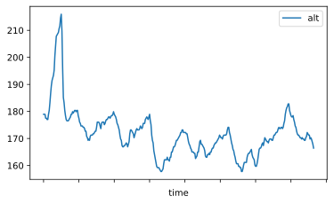
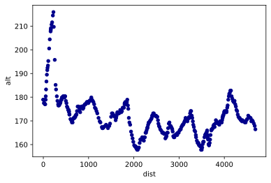

.. image:: https://raw.githubusercontent.com/corriporai/runpandas/master/docs/source/_static/images/runpandas_banner.png

RunPandas - Python Package for handing running data from GPS-enabled tracking devices and applications.
=======================================================================================================

.. image:: https://img.shields.io/pypi/v/runpandas.svg
    :target: https://pypi.python.org/pypi/runpandas/

.. image:: https://www.codefactor.io/repository/github/corriporai/runpandas/badge
   :target: https://www.codefactor.io/repository/github/corriporai/runpandas
   :alt: CodeFactor

.. image:: https://travis-ci.com/corriporai/runpandas.svg?branch=master
    :target: https://travis-ci.com/github/corriporai/runpandas

.. image:: https://coveralls.io/repos/github/corriporai/runpandas/badge.svg?branch=master
    :target: https://coveralls.io/github/corriporai/runpandas

.. image:: https://codecov.io/gh/corriporai/runpandas/branch/master/graph/badge.svg
  :target: https://codecov.io/gh/corriporai/runpandas

.. image:: https://readthedocs.org/projects/runpandas/badge/?version=latest
    :target: https://runpandas.readthedocs.io/en/latest/?badge=latest

.. image:: https://img.shields.io/badge/code%20style-black-000000.svg
     :target: https://github.com/psf/black

.. image:: https://static.pepy.tech/personalized-badge/runpandas?period=total&units=international_system&left_color=black&right_color=orange&left_text=Downloads
   :target: https://pepy.tech/project/runpandas

.. image:: https://mybinder.org/badge_logo.svg
 :target: https://mybinder.org/v2/gh/corriporai/runpandas/HEAD

=========

Introduction
------------

RunPandas is a project to add support for data collected by GPS-enabled tracking devices,
heart rate monitors data to  [pandas](http://pandas.pydata.org) objects.
It is a Python package that provides infrastructure for importing tracking data
from such devices, enabling statistical and visual analysis for running enthusiasts and lovers.
Its goal is to fill the gap between the routine collection of data and their manual analyses in Pandas and Python.

Documentation
-------------
`Stable documentation `__
is available on
`github.io <https://corriporai.github.io/runpandas/>`__.
A second copy of the stable documentation is hosted on
`read the docs <https://runpandas.readthedocs.io/>`_ for more details.

`Development documentation <https://corriporai.github.io/runpandas/devel/>`__
is available for the latest changes in master.

==> Check out `this Blog post <https://corriporai.github.io/pandasrunner/general/2020/08/01/welcome-to-runpandas.html>`_
for the reasoning and philosophy behind Runpandas, as well as a detailed tutorial with code examples.

==> Follow `this Runpandas live book <https://github.com/corriporai/runpandasbook>`_ in Jupyter notebook format based on `Jupyter Books <https://jupyterbook.org/intro.html>`_.

Install
--------

 RunPandas depends on the following packages:

- ``pandas``
- ``fitparse``
- ``stravalib``

Runpandas was tested to work on \*nix-like systems, including macOS.

-----

Install latest release version via pip
~~~~~~~~~~~~~~~~~~~~~~~~~~~~~~~~~~~~~~

.. code-block:: shell

   $ pip install runpandas

Install latest development version
~~~~~~~~~~~~~~~~~~~~~~~~~~~~~~~~~~

.. code-block:: shell

    $ pip install git+https://github.com/corriporai/runpandas.git

or

.. code-block:: shell

    $ git clone https://github.com/corriporai/runpandas.git
    $ python setup.py install

Examples
--------

Install using ``pip`` and then import and use one of the tracking
readers. This example loads a local file.tcx. From the data file, we
obviously get time, altitude, distance, heart rate and geo position
(lat/long).

.. code:: ipython3

    # !pip install runpandas
    import runpandas as rpd
    activity = rpd.read_file('./sample.tcx')

.. code:: ipython3

    activity.head(5)

.. raw:: html

    

    
    <table border="1" class="dataframe">
      <thead>
        <tr style="text-align: right;">
          <th></th>
          <th>alt</th>
          <th>dist</th>
          <th>hr</th>
          <th>lon</th>
          <th>lat</th>
        </tr>
        <tr>
          <th>time</th>
          <th></th>
          <th></th>
          <th></th>
          <th></th>
          <th></th>
        </tr>
      </thead>
      <tbody>
        <tr>
          <th>00:00:00</th>
          <td>178.942627</td>
          <td>0.000000</td>
          <td>62.0</td>
          <td>-79.093187</td>
          <td>35.951880</td>
        </tr>
        <tr>
          <th>00:00:01</th>
          <td>178.942627</td>
          <td>0.000000</td>
          <td>62.0</td>
          <td>-79.093184</td>
          <td>35.951880</td>
        </tr>
        <tr>
          <th>00:00:06</th>
          <td>178.942627</td>
          <td>1.106947</td>
          <td>62.0</td>
          <td>-79.093172</td>
          <td>35.951868</td>
        </tr>
        <tr>
          <th>00:00:12</th>
          <td>177.500610</td>
          <td>13.003035</td>
          <td>62.0</td>
          <td>-79.093228</td>
          <td>35.951774</td>
        </tr>
        <tr>
          <th>00:00:16</th>
          <td>177.500610</td>
          <td>22.405027</td>
          <td>60.0</td>
          <td>-79.093141</td>
          <td>35.951732</td>
        </tr>
      </tbody>
    </table>
    

The data frames that are returned by runpandas when loading files is
similar for different file types. The dataframe in the above example is
a subclass of the ``pandas.DataFrame`` and provides some additional
features. Certain columns also return specific ``pandas.Series``
subclasses, which provides useful methods:

.. code:: ipython3

    print (type(activity))
    print(type(activity.alt))

.. parsed-literal::

    <class 'runpandas.types.frame.Activity'>
    <class 'runpandas.types.columns.Altitude'>

For instance, if you want to get the base unit for the altitude ``alt``
data or the distance ``dist`` data:

.. code:: ipython3

    print(activity.alt.base_unit)
    print(activity.alt.sum())

.. parsed-literal::

    m
    65883.68151855901

.. code:: ipython3

    print(activity.dist.base_unit)
    print(activity.dist[-1])

.. parsed-literal::

    m
    4686.31103516

Let’s play with the data. Let’s show distance vs as an example of what
and how we can create visualizations. In this example, we will use the
built in, matplotlib based plot function.

.. code:: ipython3

    activity[['dist']].plot()

.. parsed-literal::

    Matplotlib is building the font cache; this may take a moment.

.. parsed-literal::

    <AxesSubplot:xlabel='time'>

.. image:: examples/overview_files/overview_10_2.svg

And here is altitude versus time.

.. code:: ipython3

    activity[['alt']].plot()

.. parsed-literal::

    <AxesSubplot:xlabel='time'>

Finally, lest’s show the altitude vs distance profile. Here is a
scatterplot that shows altitude vs distance as recorded.

.. code:: ipython3

    activity.plot.scatter(x='dist', y='alt', c='DarkBlue')

.. parsed-literal::

    <AxesSubplot:xlabel='dist', ylabel='alt'>

Finally, let’s watch a glimpse of the map route by plotting a 2d map
using logintude vs latitude.

.. code:: ipython3

    activity.plot(x='lon', y='lat')

.. parsed-literal::

    <AxesSubplot:xlabel='lon'>

.. image:: examples/overview_files/overview_16_1.svg

Get in touch
------------
- Report bugs, suggest features or view the source code [on GitHub](https://github.com/corriporai/runpandas).

I'm very interested in your experience with runpandas.
Please drop me an note with any feedback you have.

Contributions welcome!

\- **Marcel Caraciolo**

License
-------
Runpandas is licensed under the **MIT License**. A copy of which is included in LICENSE.